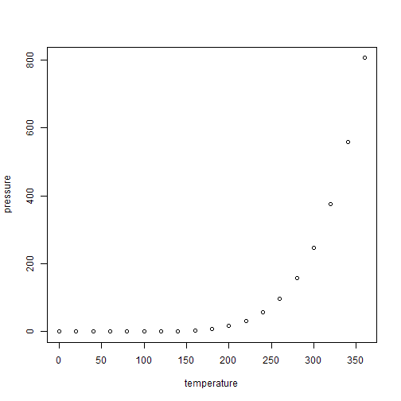

<!-- README.md is generated from README.Rmd. Please edit that file -->


# recetox.aplcms.adapters

<!-- badges: start -->
[](https://www.tidyverse.org/lifecycle/#experimental)
[](https://CRAN.R-project.org/package=recetox.aplcms.adapters)
[](https://codecov.io/gh/hechth/recetox.aplcms.adapters?branch=master)
[](https://github.com/hechth/recetox.aplcms.adapters/actions)
<!-- badges: end -->

The goal of recetox.aplcms.adapters is to ...

## Installation

You can install the released version of recetox.aplcms.adapters from [CRAN](https://CRAN.R-project.org) with:

``` r
install.packages("recetox.aplcms.adapters")
```

And the development version from [GitHub](https://github.com/) with:

``` r
# install.packages("devtools")
devtools::install_github("hechth/recetox.aplcms.adapters")
```
## Example

This is a basic example which shows you how to solve a common problem:


```r
library(recetox.aplcms.adapters)
#> Error in library(recetox.aplcms.adapters): there is no package called 'recetox.aplcms.adapters'
## basic example code
```

What is special about using `README.Rmd` instead of just `README.md`? You can include R chunks like so:


```r
summary(cars)
#>      speed           dist       
#>  Min.   : 4.0   Min.   :  2.00  
#>  1st Qu.:12.0   1st Qu.: 26.00  
#>  Median :15.0   Median : 36.00  
#>  Mean   :15.4   Mean   : 42.98  
#>  3rd Qu.:19.0   3rd Qu.: 56.00  
#>  Max.   :25.0   Max.   :120.00
```

You'll still need to render `README.Rmd` regularly, to keep `README.md` up-to-date.

You can also embed plots, for example:



In that case, don't forget to commit and push the resulting figure files, so they display on GitHub!
